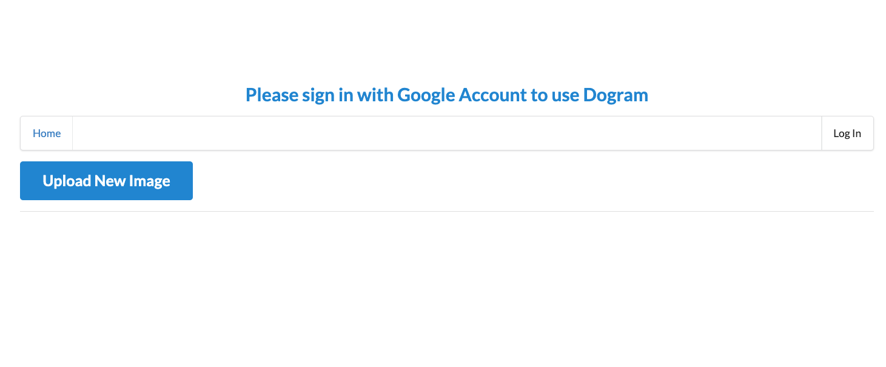
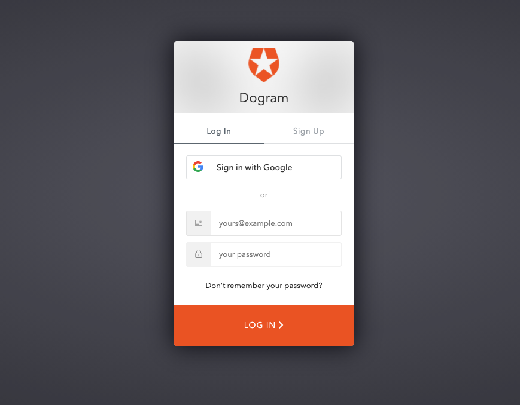
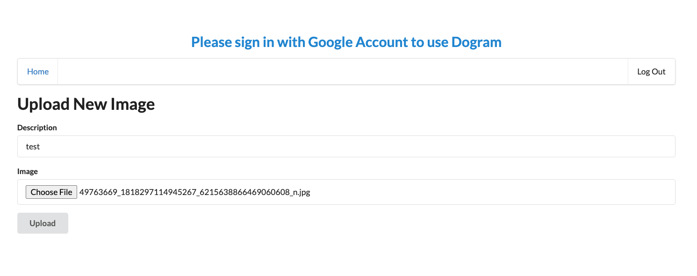
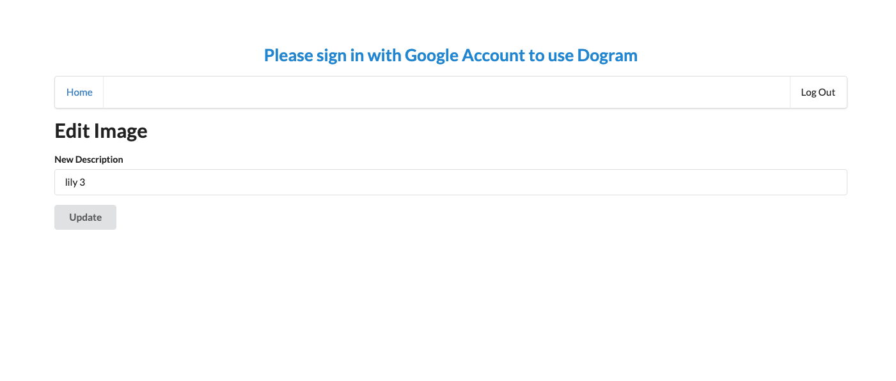
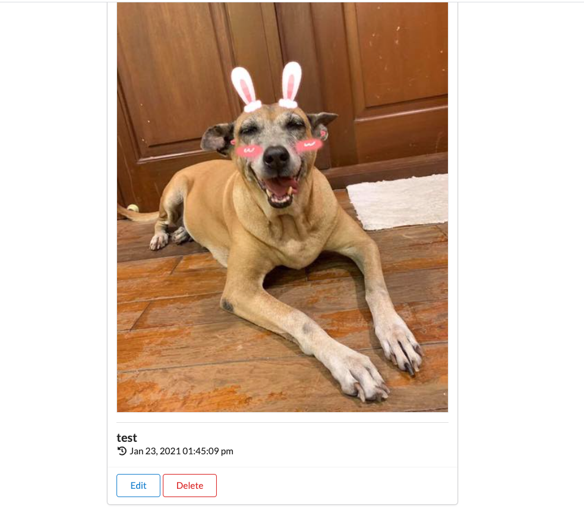

# Udacity Cloud Developer Nanodegree Capstone

**DogLookBook** is a Udacity capstone project for the [Cloud Developer Nanodegree](https://www.udacity.com/course/cloud-developer-nanodegree--nd9990). It is a Serverless web application where users can keep information of their dog(s). 

## Demo: 


## Table of Contents
1. [Functionalities](#functionalities)
1. [Tech Stack](#tech-stack)
2. [Getting Started](#getting-started)
3. [API Endpoints](#api-endpoints)
4. [How to use the application](#how-to-use-the-application)
5. [Functionalities](#functionalities)
6. [Udacity Requirements](#udacity-capstone-requirements)

## Functionalities:
- [x] Application can be able to CREATE, UPDATE, DELETE, POST an item.
- [x] User can click on "Upload New Image" button to select and UPLOAD an item. 
- [x] Application can be login/logout and show contents of the current user. 
- [x] User needs to be authenticated

## Tech Stack: 
- [Serverless Framework](https://www.serverless.com/)
- [React.js](https://reactjs.org/)
- [AWS](https://aws.amazon.com/) DynamoDB, Cloudwatch, Lambda, API Gateway, Cloudformation, S3, X-Ray, SDK
- [auth0.com](Auth0) using RS256 Algorithm

## Getting Started:
### Go to [Backend](server) by running: 
```
cd server
npm install
sls deploy -v
```

### Go to [Frontend](client) by running:
```
cd client
npm install
npm run start
```

### Debugging with [Postman](postman) and [AWS X-Ray](https://aws.amazon.com/xray/) Tracing: 
```
cd postman
```

## API Endpoints: 
| **Method** | **endpoint** |
| ---------- | ------------ |
| **GET**    | `https://stzf6sj4g6.execute-api.us-east-2.amazonaws.com/dev/images`|
| **POST**   | `https://stzf6sj4g6.execute-api.us-east-2.amazonaws.com/dev/images`|
| **PATCH**  | `https://stzf6sj4g6.execute-api.us-east-2.amazonaws.com/dev/images/{imageId}`|
| **DELETE** | `https://stzf6sj4g6.execute-api.us-east-2.amazonaws.com/dev/images/{imageId}`|
| **POST**   | `https://stzf6sj4g6.execute-api.us-east-2.amazonaws.com/dev/images/s3/{imageId}`|

## How to use the application: 
1. First, user should login to the application with by click on the ```Log In``` button.

2. Second, user should login with Googgle in order to use Auth0 authentication. This application only has option to login with Google account. 


### Create a new dog 
To create a new dog, click on ```Upload New Image```.
1. Fill in description and image data.
2. Click ```Upload```


### Update a dog
To update an existing dog, click on the ```Edit``` button of the newly created dog.
1. Enter new description in Edit page
2. Click ```Update```


### Delete a dog
To delete a dog, click on the ```Delete``` button of the newly created dog.


## Udacity Capstone Requirements
1. **Codebase:** 
- [x] Lambda function codes has to split into multiple files/classes. 
- [x] Business logic is seperated from code for database access, file storage, etc. 
- [x] Using `async/await` contructs instead of passing `callbacks`. 
2. **Best Practices:**
- [x] All resources needed to be defined in `serverless.yml`. 
- [x] All permissions are defined per function in `serverless.yml`.
- [x] Application has distributed tracing enabled, log statements, or level metrics
- [x] Incoming HTTP requests are validated in Lambda handlers or using request validation via API Gateway using `serverless-reqvalidator-plugin`. 
3. **Architecure:** 
- [x] Has 1:M relationship between users and items modeled using DynamoDB. 
- [x] Has a composite key with both partition and sort keys. 
```
KeySchema: 
    - AttributeName: partitionKey
      KeyType: HASH
    - AttributeName: sortKey
      KeyType: RANGE
```
- [x] Items are fetched using `.query()` instead of `.scan()` method. 
