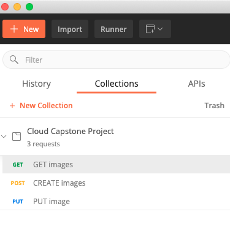
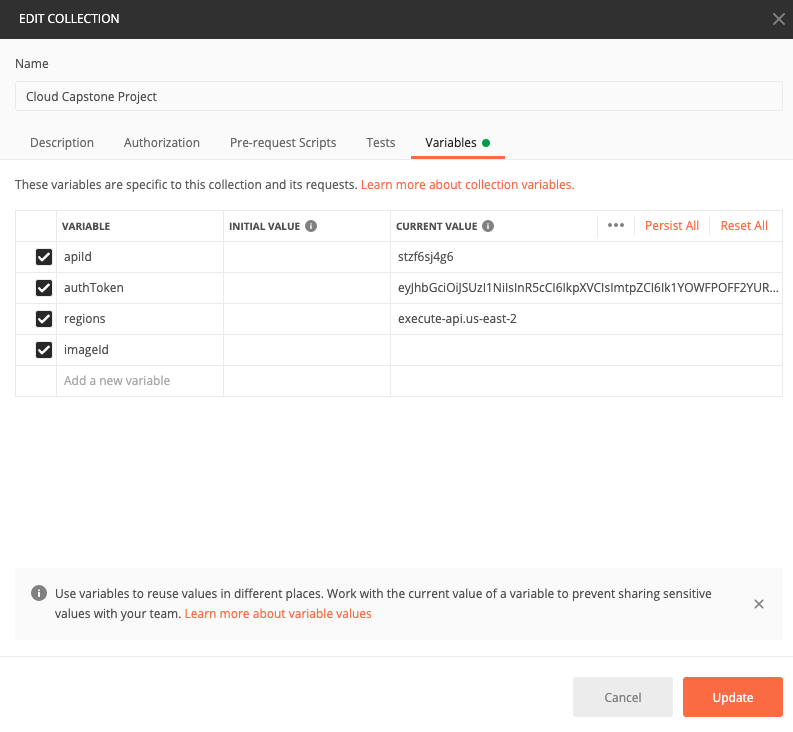
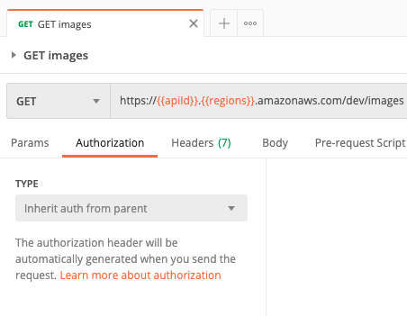
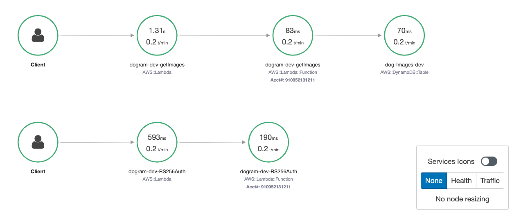

# Debugging

An alternative way to test and debug API and error is to use Postmand and AWS X-Ray. 

## Postman:

1. Import postman JSON file into Postman as: 

2. Provide corresponding value into each variable: 

3. Make sure to use ```Inherit auth from parent``` option for the type under Authorization section



## AWS X-Ray: 
 AWS X-Ray is used for distributed tracing in order to debugging. An example of using AWS X-Ray tracing for the GET lambda function is shown below: 
