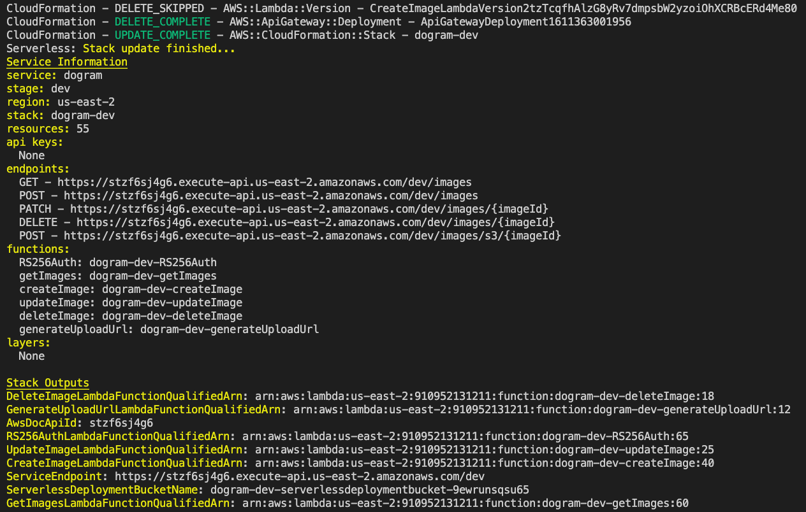
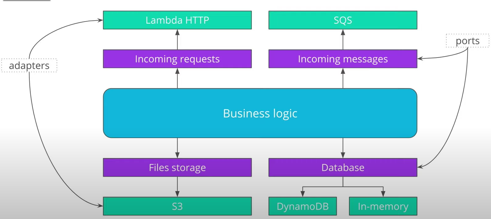

# Server Side

> Using **Serverless Framework:**

### How to run server:
1. Install all dependencies:
2. Deploy with Serverless to Cloudformation: 
```
npm install
sls deploy -v
```

3. Successfully deployment of backend to Cloudformation should be seen in the console as: 



### How to run DynamoDB Locally: 
Open 2 terminals, 1 for local DynamoDB and 1 for local Web Server with: 
1. Run DynamoDB locally: ```sls dynamodb install```, then ```sls dynamodb start```
2. Run a web server locally: ```sls offline```
```
sls dynamodb install
sls dynamodb start
sls offline
```

## How to setup Dependencies and Dev-Dependencies: 

### Setup Serverless on AWS credentials:
```sls config credentials --provider aws --key [YOUR_ACCESS_KEY] --secret [YOUR_SECRET_KEY] --profile [YOUR_IAM_USERNAME]```

### To use Serverless with Nodejs, AWS and Typescript, install: 
``` serverless create --template aws-nodejs-typescript --path server```

### Install Dependencies and Dev-Denpendencies: 
``` npm install aws-xray-sdk cors elasticsearch http-aws-es jsonwebtoken middy uuid winston -S```

``` npm install @types/jsonwebtoken @types/elasticsearch aws-sdk serverless-aws-documentation serverless-dynamodb-local serverless-iam-roles-per-function serverless-reqvalidator-plugin serverless-plugin-tracing --save-dev```


### DynamoDB Table Schema: 

| Partition Key | Sort Key      | attributes
| ------------- | :-----------: | -------------------------------- |
| `userId`      | `imageId`     | createdAt, imageUrl, description |

#### **Global Index Table Schema:**

| Partition Key | Sort Key      | attributes
| ------------- | :-----------: | ------------------------------ |
|   `userId`    | `createdAt`   | imageId, imageUrl, description |

### Models: 

1. **Image Item Model of DynamoDB Base Table:**

Each Image item has the following fields: 

* `userId` (string) - unique id of an user
* `imageId` (string) - unique id of an image
* `description` (boolean) - description of an image
* `createdAt` (string) - date and time when an image was created
* `imageUrl` (boolean) - a URL pointing to an image using S3

2. **Image Update Item Model of Secondary Index Table:**

Each image item requires the following fields when updating: 

* `description` (string) - description of an image

### Request Validator Models: 
1. **Create Request Model:**

Field(s) required when make a request to create a new image: 

* `description` (string) - description of an image

2. **Update Request Model:**

Field(s) required when make a request to update an image: 

* `description` (string) - description of an image

## Backend: 

The ```server``` folder organizes files under hexagonal architectures (as shown in diagram) to avoid vendor lock-in. This seperates application into 2 components: Business Logic and Ports and adapters. 
* ```Business logic```: implements logic of the application
* ```Ports and Adapters```: those that interacts with outside services such as databases, etc. 



### Directory Layout: 
```
.
├── .dynamodb
├── .serverless
├── node_modules
├── package.json
├── serverless.yml
├── tsconfig.json
├── webpack.config.js
├── README.md
├── req-validator (JSON Schema)
    ├── create-image-request.json
    ├── update-image-request.json
├── src 
    ├── auth
        ├── Jwt.ts
        ├── JwtPayload.ts
    ├── businessLogic
        ├── imageLogic.ts
    ├── dataLayer
        ├── accessLayer.ts
    ├── lambda
        ├── auth
            ├── authOAuthorizer.ts
        ├── http
            ├── createImage.ts
            ├── deleteImage.ts
            ├── generateUpload.ts
            ├── getImages.ts
            ├── updateImage.ts
    ├── model-interface
        ├── ImageItem.ts
        ├── ImageUpdate.ts
    ├── request-interfaces
        ├── CreateImageRequest.ts
        ├── UpdateImageRequest.ts
    ├── utils
        ├── getAuthorization.ts
        ├── logger.ts
        ├── parseUserId.ts
        
``` 